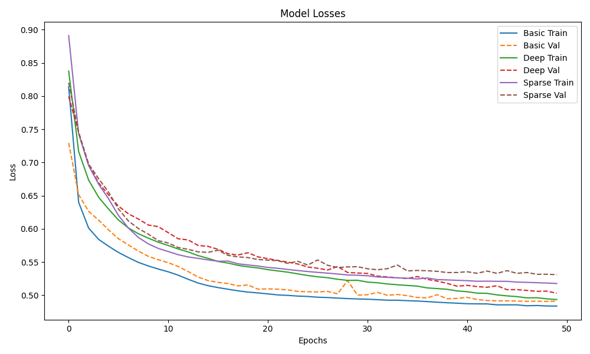
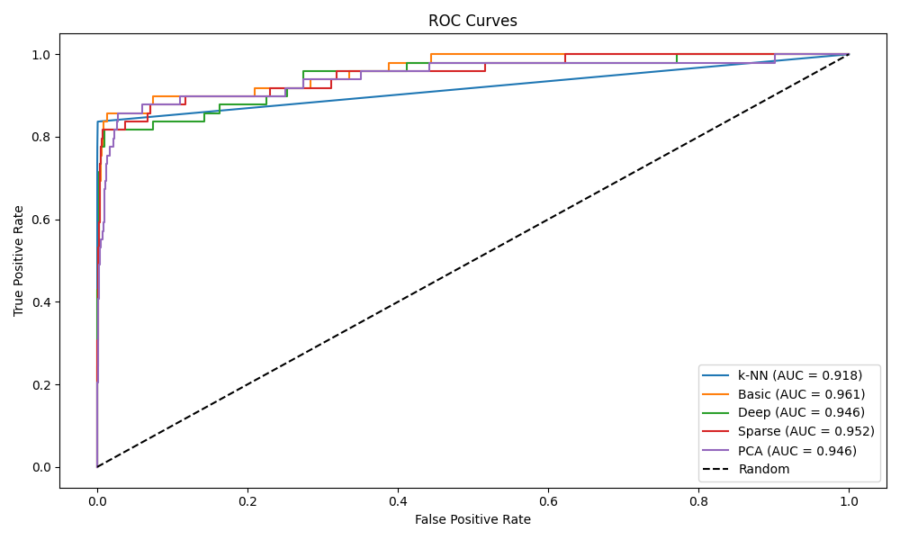
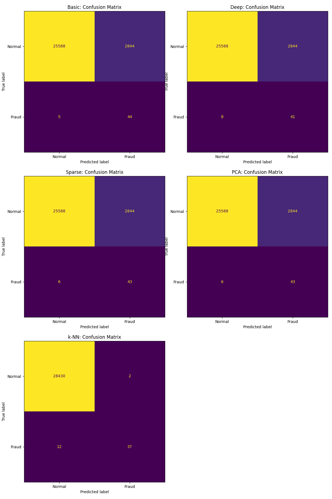

# Podsumowanie

## Zbiór danych

Wykorzystaliśmy zbiór danych Credit Card Fraud Detection[^1] ze strony Kaggle. Zawiera 492 transakcje z anomaliami spośród 284,807 transakcji, co stanowi wysoce niezbalansowany zbiór z 0.172% klas pozytywnych, czyli transakcji z anomaliami. Znajduje się w nim 28 cech zanonimizowanych, które uległy transformacji PCA, kwota transakcji, oraz czas, jaki upłynął od pierwszej transakcji ze zbioru.

## Przygotowanie danych

Wszystkie dane ze zbioru przeskalowaliśmy za pomocą StandardScaler, aby żadna z cech nie dominowała pozostałych.

## Architektury modeli

Przetestowaliśmy 5 modeli - K najbliższych sąsiadów, oraz PCA i 3 architektury sieci neuronowych jako autoenkodery.
Poniższe tabele opisują architektury zastosowanych autoenkoderów, gdzie pierwsza odnosi się do enkoderów, a druga do dekoderów.

| Numer wartwy | Prosty | Głęboki      | Rzadki | PCA |
|--------------|--------|--------------|--------|-----|
| 1.           | 30     | 30           | 30     | 30  |
| 2.           | 15     | Dropout(0.2) | 15     | 10  |
| 3.           | 7      | 20           | 7      | -   |
| 5.           | -      | 10           | -      | -   |
| 6.           | -      | 5            | -      | -   |

| Numer wartwy | Prosty | Głęboki | Rzadki | PCA |
|--------------|--------|---------|--------| --- |
| 1.           | 7      | 5       | 7      | 10  |
| 2.           | 15     | 10      | 15     | 30  |
| 3.           | 30     | 20      | 30     | -   |
| 5.           | -      | 30      | -      | -   |

K najbliższych sąsiadów korzystało z 5 najbliższych sąsiadów.

## Trening modeli

Każdy model wytrenowaliśmy na 80% całego zbioru danych, ale do treningu autoenkoderów wybraliśmy tylko transakcje bez anomalii, aby nauczyć je odtwarzać tylko ten rodzaj transakcji. Przy podziale zbioru zastosowaliśmy parametr stratify, aby zachować proporcje klas z oryginalnego zbioru.

Sieci neuronowe były uczone w 50 epokach, gdzie każda była korzystała z batch'y z 256 próbkami, optymalizatora Adam i błędu średniokwadratowego jako funkcją straty. 

## Wyniki

Przy ewaluacji autoenkoderów, decyzja o tym, czy dana transakcja jest anomalią była podejmowana poprzez obliczenie progu decyzji. Był on ustanawiany poprzez obliczenie dziewiędziesiątego percentylu ze zbioru uzyskanych średnich błędów kwadratowych dla każdej zrekonstruowanej transakcji. Finalne predykcje zostały obliczone poprzez porówanie średniego błędu kwadratowego dla każdej transakcji z wcześniej obliczonym progiem decyzji.

| Model        | Precyzja | Czułość | F1   | AUC  |
|--------------|----------|---------|------|------|
| K-NN         | 0.95     | 0.76    | 0.84 | 0.9  |
| PCA          | 0.01     | 0.88    | 0.03 | 0.95 |
| Prosta sieć  | 0.01     | 0.88    | 0.03 | 0.95 |
| Głęboka sieć | 0.01     | 0.86    | 0.03 | 0.95 |
| Rzadka sieć  | 0.01     | 0.84    | 0.03 | 0.93 |

Porównanie k-NN z autoenkoderami można uznać za niesprawiedliwe, ponieważ k-NN uczyło się na całym zbiorze danych, ale w tym zestawieniu porównujemy jakie są tego efekty. Zrezygnowaliśmy z wykorzystania dokładności do porównania wyników modeli, jako, że mówiła ona jedynie o tym, jak dobrze model rozpoznaje prawdziwe transakcje, a nie anomalie. 
Wysoka precyzja modelu K-NN, wskazuje to, że K-NN wykrywał dużo mniej wartości fałszywie pozytywnych od autoenkoderów, co widać na macierzach pomyłek poniżej. Najważniejszą dla nas metryką z powyższej tabelii jest czułość, jako, że mówi o tym, jak dobrze modele rozpoznają anomalie. Autoenkodery zyskały lepsze wyniki od klasyfikatora k najbliższych sąsiadów, ale w rzeczywistym zastosowaniu taka skuteczność mogłaby przynieść duże straty finansowe.
Metryka F1 mówi o tym, jak dobrze model równoważy wykrywanie prawdziwych anomalii z fałszywymi alarmami. Wszystkim autoenkoderom wychodziło to tak samo, a k-NN radził sobie z tym znacznie lepiej.
Wynik AUC wszystkich modeli jest wysoki, zwłaszcza autoenkoderów, co oznacza, że modele dają wyższą rangę transakcjom z anomaliami, niż tym bez anomalii.

###  Straty treningowe i walidacyjne

Wykresy uzyskanych strat wskazują, że modele dobrze nauczyły się rekonstruować transakcje bez anomalii. Nagłe skoki w stracie walidacyjnej sugerują, że prawdopodobnie modele gorzej rekonstruowały niektóre transakcje, których nie widzały poczas treningu.

### Krzywe ROC i wyniki AUC

Przy bardzo wysokim progu decyzji najlepiej się sprawdzała technika k najbliższych sąsiadów. Wraz z obniżaniem wartości progu decyzji, przewaga tej techniki nad innymi modelami coraz bardziej malała. Modele - prosty, głęboki, oraz PCA osiągnęły podobne wyniki i radziły sobie lepiej od metody k najbliższych sąsiadów, kiedy próg był nieco niższy. 

### Macierze pomyłek

Najlepiej wykrywały anomalie model prosty i PCA. Wszystkie modele bardzo dobrze klasyfikowały brak anomalii w stosunku do liczby wszystkich próbek znajdujących się w zbiorze testowym, jednak autoenkodery oznczały dużo transakcji tego rodzaju jako anomalie, co również mogłoby przynieść duże koszty.

## Porówanie z wynikami osiągniętymi w publikacjach wykorzystujących ten sam zbiór danych

W publikacjach, dotyczących tego zbioru danych stosowano różne techniki klasycznych klasyfikacji[^2, ^4, ^5], uczenia nadzorowanego[^5], nienadzorowanego[^3, ^4]. Zdecydowaliśmy, że porównamy je z sieciami neuronowymi, drzewem decyzyjnym, oraz lasem losowym z "An Empirical Study on Credit Risk Assessment Using Machine Learning: Evidence from the Kaggle Credit Card Fraud Detection Dataset"[^5], dlatego, że techniki są nam znane, i z autoenkoderem z "Credit Card Fraud Detection Using Autoencoder Model in Unbalanced Datasets"[^4], aby porównać wyniki autoenkoderów innych autorów. W poniższej tabeli znajdują się wyniki tych modeli:

| Technika                                      | Precyzja | Czułość | F1    |
| --------------------------------------------- | -------- | ------- | ----- |
| Drzewo decyzyjne [^5]                         | 0.883    | 0.734   | 0.800 |
| Las losowy [^5]                               | 0.915    | 0.807   | 0.858 |
| Sieci neuronowe [^5]                          | 0.928    | 0.854   | 0.889 |
| Regresja logistyczna (dane zbalansowane) [^4] | 0.06     | 0.90    | 0.12  |
| Regresja logistyczna (dane niezbalans.) [^4]  | 0.93     | 0.57    | 0.71  |
| Autoenkoder (próg = 5) [^4]                   | 0.011    | 0.64    | 0.19  |
| Autoenkoder (próg = 3) [^4]                   | 0.067    | 0.79    | 0.12  |
| Autoenkoder (próg = 1) [^4]                   | 0.073    | 0.86    | 0.13  |
| Autoenkoder (próg = 0.7) [^4]                 | 0.09     | 0.91    | 0.04  |

Porównując nasze modele z tymi z publikacji, nasze autoenkodery uzyskały najgorszą precyzję, a k-NN najlepszą. Autoenkodery z [^4] miały podobne wyniki tej metryki, co wynika z tego samego powodu co w naszym rozwiązaniu, czyli dużej ilości przypadków fałszywyie pozytywnych. 
Czułość wszystkich naszych autoenkoderów była lepsza, niż u [^4], poza przypadkiem, próg klasyfikacji w [^4] był równy 0.7. To sugeruje, że sugeruje, że niezależnie od architektury, taka minimalna wartość progu uzyskała najlepszy wynik wykrywania anomalii, oczywiście kosztem wielu dodatkowych przypadków fałszywyie pozytywnych. 
Metryka F1 podsumowuje te obserwacje, wskazując na duże dysproporcje między wartością czułości, a precyzji u autoenkoderów, z czym pozostałe techniki, prócz regresji logistycznej, nie miały tak dużego problemu.

## Bibliografia

[^1] [Credit Card Fraud Detection](https://www.kaggle.com/datasets/mlg-ulb/creditcardfraud) 
[^2]  Lakshmi S V S S, Selvani Deepthi Kavila (2018) [Machine Learning For Credit Card Fraud Detection System](https://d1wqtxts1xzle7.cloudfront.net/106080716/ijaerv13n24_18-libre.pdf?1696074897=&response-content-disposition=inline%3B+filename%3DMachine_Learning_for_Credit_Card_Fraud_D.pdf&Expires=1769983990&Signature=bODsgvGZ7twUpJcLMkWAqg-s988dc00aJ-mak9jf5xcS0Iouc6e-rWSq4QWW2ruOyMDdNeEP8PbayNv2lLtUVms3Q-r~PDPAI7SajjWkcQ7ZuORYPTfx6cHZJyyoIA0wEUMRceuEFHUckfbVzf~YOxJ3McRHlvdkHF7Xo0nJrwlW-qohqcdnLsUbzm9fqvM99TD3ckV9AhqF~rLdxn7Ri6T1talJbOmnx8xOO97Z1S~B4Liqr~nqzlGz~0AupozLUzL75qNEaddX5oIAyoMihbNSLYrPTuJmusDF3gcevHyYxC2VSoBKvWBnK1ofwCYvo6JzQoM5Num0Qk94VTD-Hg__&Key-Pair-Id=APKAJLOHF5GGSLRBV4ZA), [J] International Journal of Applied Engineering Research 
[^3] Mohammad Aman Ullah (2025) [AD-KMeans: A Novel Clustering Algorithm for Fraud Detection in Imbalanced Datasets](https://doaj.org/article/a5e117f881434b9aadd78b9648824451#:~:text=identification%20of%20hidden%20fraudulent%20activity,score%20%2887.6%25%29%2C%20improving%20recall), [P] Wiley 
[^4] M. A. Al-Shabi (2019) [Credit Card Fraud Detection Using Autoencoder Model in Unbalanced Datasets](), [J] Journal of Advances in Mathematics and Computer Science 
[^5] Qi, R. (2025) [An Empirical Study on Credit Risk Assessment Using Machine Learning: Evidence from the Kaggle Credit Card Fraud Detection Dataset](https://www.gbspress.com/index.php/JCSSR/article/view/403), [J] Journal of Computer, Signal, and System Research, 2(5), 48-64.